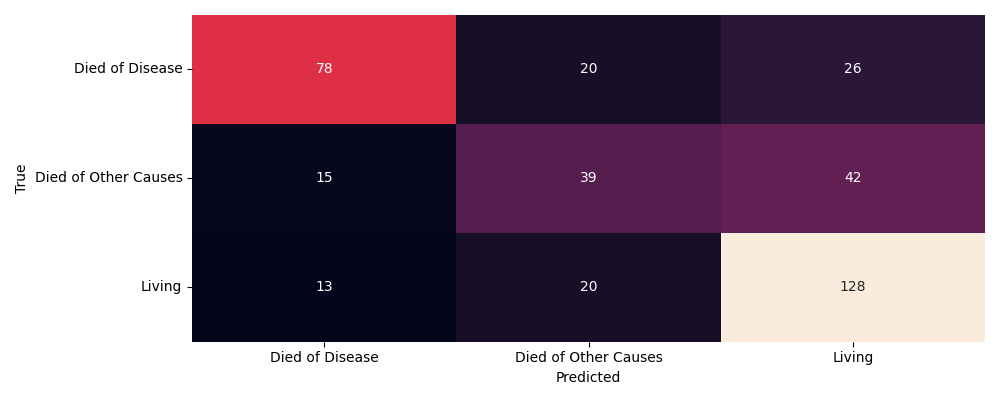
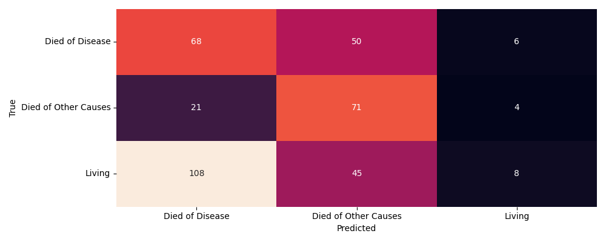
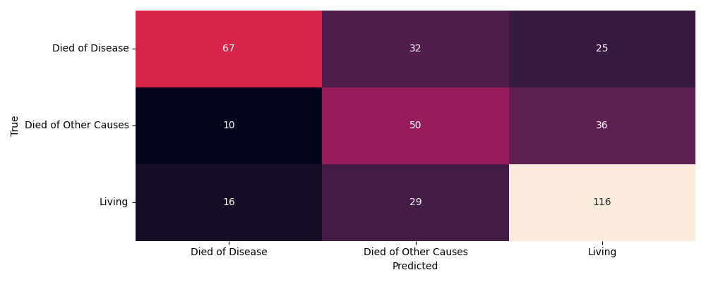
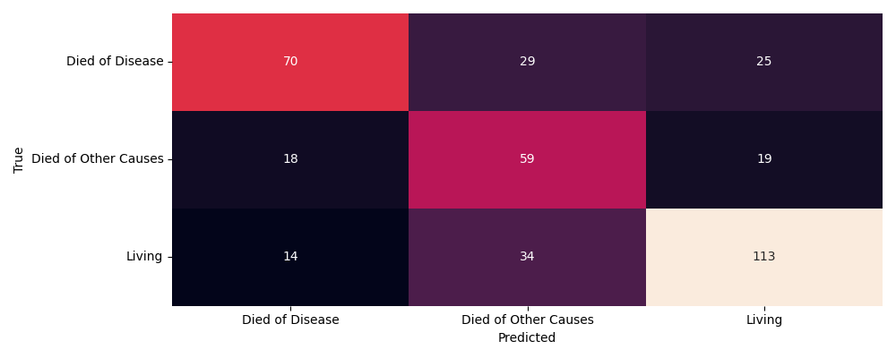
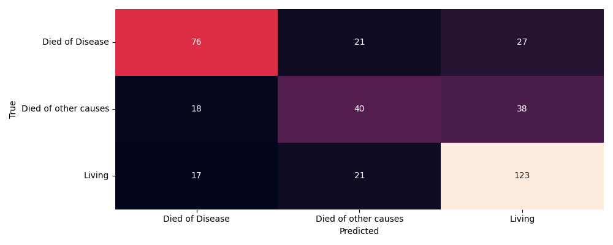
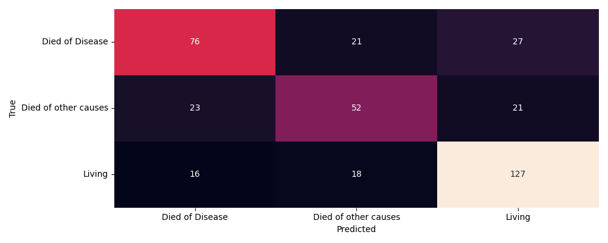

# Wstęp

## Temat projektu

Tematem projektu jest analiza zbioru danych Breast Cancer Gene
Expression Profiles (METABRIC) zawierającego informacje dotyczące cech
klinicznych pacjentów oraz genomicznych oraz budowa modelu
przewidującego klasę zmiennej wynikowej *death from cancer* tzn. czy dana pacjentka umrze z powodu nowotworu, innych przyczyn (głównie medycznych), czy przeżyje.

## Opis zbioru

Zbiór składa się z 30 zmiennych klinicznych 173 zmiennych binarnych
informujące o wystąpieniu lub braku mutacji danego genu i 489 zmiennych
dotyczących poziomu ekspresji genów.

```{python}
import pandas as pd
pd.set_option('display.max_rows', None)
pd.set_option('display.max_columns', None)
pd.set_option('display.width', None)
zmienne = [
    "patient_id",
    "age_at_diagnosis",
    "type_of_breast_surgery",
    "cancer_type",
    "cancer_type_detailed",
    "cellularity",
    "chemotherapy",
    "pam50_+_claudin-low_subtype",
    "cohort",
    "er_status_measured_by_ihc",
    "er_status",
    "neoplasm_histologic_grade",
    "her2_status_measured_by_snp6",
    "her2_status",
    "tumor_other_histologic_subtype",
    "hormone_therapy",
    "inferred_menopausal_state",
    "integrative_cluster",
    "primary_tumor_laterality",
    "lymph_nodes_examined_positive",
    "mutation_count",
    "nottingham_prognostic_index",
    "oncotree_code",
    "overall_survival_months",
    "overall_survival",
    "pr_status",
    "radio_therapy",
    "3-gene_classifier_subtype",
    "tumor_size",
    "tumor_stage",
    "death_from_cancer"
]

opisy = [
    "Identyfikator pacjenta",
    "Wiek przy diagnozie",
    "Typ operacji piersi",
    "Typ nowotworu",
    "Szczegółowy typ nowotworu",
    "Komórkowość guza",
    "Chemioterapia (tak/nie)",
    "Podtyp molekularny PAM50/Claudin-low",
    "Grupa badawcza",
    "Status ER mierzony IHC",
    "Status receptorów estrogenowych",
    "Stopień histologiczny guza",
    "Status HER2 mierzony SNP6",
    "Status HER2",
    "Podtyp histologiczny nowotworu",
    "Terapia hormonalna (tak/nie)",
    "Status menopauzalny",
    "Klaster molekularny",
    "Lokalizacja guza (lewa/prawa pierś)",
    "Liczba zajętych węzłów chłonnych",
    "Liczba mutacji",
    "Indeks prognostyczny Nottingham",
    "Kod klasyfikacji OncoTree",
    "Rzeczywisty czas przeżycia w miesiącach",
    "Status przeżycia",
    "Status receptorów progesteronowych",
    "Radioterapia (tak/nie)",
    "Podtyp klasyfikatora 3-genowego",
    "Rozmiar guza",
    "Stadium nowotworu",
    "Przyczyna zgonu / status życia"
]
p=pd.DataFrame({
    'zmienna':zmienne,
    'opis': opisy
})
p.style.set_table_styles([
    {
        'selector': 'table',
        'props': [('border-collapse', 'collapse')]
    },
    {
        'selector': 'th, td',
        'props': [
            ('border', '1px solid black'),
            ('padding', '5px')
        ]
    }
])
display(p)
```

## Braki danych

Poniższa ramka zawiera liczbę braków danych w kolumnach i ich udział
procentowy

```{python}
import pandas as pd

pd.set_option('display.max_rows', None)
pd.set_option('display.max_columns', None)
pd.set_option('display.width', None)

dane = pd.read_csv("braki_danych.csv", sep=';')
dane.style.set_table_styles([
    {
        'selector': 'table',
        'props': [('border-collapse', 'collapse')]
    },
    {
        'selector': 'th, td',
        'props': [
            ('border', '1px solid black'),
            ('padding', '5px')
        ]
    }
])
display(dane)
```

```{python}
import pandas as pd


dane = pd.read_csv("dane2.csv", sep=';')
liczba_p=[dane.isna().sum().sum()]
p=pd.DataFrame({'liczba_braków':liczba_p})


display(p)
```

Tyle komórek zawiera brak.

```{python}
import pandas as pd
pd.set_option('display.max_rows', None)
pd.set_option('display.max_columns', None)
pd.set_option('display.width', None)
dane=pd.read_csv('dane2.csv', sep=';')
l=[dane.isna().all(axis=1).sum()]
p=pd.DataFrame({'puste rekordy':l})
p.style.set_table_styles([
    {
        'selector': 'table',
        'props': [('border-collapse', 'collapse')]
    },
    {
        'selector': 'th, td',
        'props': [
            ('border', '1px solid black'),
            ('padding', '5px')
        ]
    }
])
display(p)

```

Brak całkowicie pustych wierszy.

```{python}
import pandas as pd
dane=pd.read_csv('dane2.csv', sep=';')
l=[dane.isna().any(axis=1).mean()*100]
p=pd.DataFrame({'Procent wierszy zawierających przynajmniej jeden brak':l})
p.style.set_table_styles([
    {
        'selector': 'table',
        'props': [('border-collapse', 'collapse')]
    },
    {
        'selector': 'th, td',
        'props': [
            ('border', '1px solid black'),
            ('padding', '5px')
        ]
    }
])
display(p)
```

Tylko około 40% wierszy jest całkowicie pełnych

# Eksploracja zbioru

## Mechanizm braków danych

Rodzaj braków danych będzie decydował o sposobie ich uzupełnienia
dlatego została zbadana zależność braków od zmiennych kategorycznych za
pomocą testu $\chi^2$

```{python}
import pandas as pd
pd.set_option('display.max_rows', None)
pd.set_option('display.max_columns', None)
pd.set_option('display.width', None)
wynik=pd.read_csv("wynik.csv", sep=";")
wynik.style.set_table_styles([
    {
        'selector': 'table',
        'props': [('border-collapse', 'collapse')]
    },
    {
        'selector': 'th, td',
        'props': [
            ('border', '1px solid black'),
            ('padding', '5px')
        ]
    }
])
display(wynik.iloc[:,1:5].head(10))
```

Uwzględniono jedynie zmienne charakteryzujące się liczbą braków większą
od mediany liczby brakujących obserwacji.

Jednak ilość wykonanych testów:

```{python}
import pandas as pd
pd.set_option('display.max_rows', None)
pd.set_option('display.max_columns', None)
pd.set_option('display.width', None)
wynik=pd.read_csv("wynik.csv", sep=";")
l=[len(wynik)]
p=pd.DataFrame({'liczba_testów_chi2:':l})
p.style.set_table_styles([
    {
        'selector': 'table',
        'props': [('border-collapse', 'collapse')]
    },
    {
        'selector': 'th, td',
        'props': [
            ('border', '1px solid black'),
            ('padding', '5px')
        ]
    }
])
display(p)
```

Sprawia, że prawdopodobieństwa niesłusznego odrzucenia hipotezy zerowej
o naturze MCAR (*Missing completely at random*) wynosi:

```{python}
import pandas as pd
wynik=pd.read_csv("wynik.csv", sep=";")
x=1-(1-0.05)**len(wynik)
print(f"{x:4e}")
```

Jest niemal pewne, że uznamy odrzucimy hipotezę zerową niesłusznie
przynajmniej raz. Dlatego zastosowano poprawkę Benjaminiego-Hochberga.

Dodatkowo każdą parę sklasyfikowano według typu relacji: gene–gene,
clinic–clinic, gene–clinic lub clinic–gene, co umożliwiło ocenę
zależności pomiędzy brakami danych w obrębie oraz pomiędzy grupami
zmiennych. Nowy wynik po korekcie:

```{python}
import pandas as pd
pd.set_option('display.max_rows', None)
pd.set_option('display.max_columns', None)
pd.set_option('display.width', None)
wynik=pd.read_csv("wynik_po_korekcie.csv", sep=";")
wynik.style.set_table_styles([
    {
        'selector': 'table',
        'props': [('border-collapse', 'collapse')]
    },
    {
        'selector': 'th, td',
        'props': [
            ('border', '1px solid black'),
            ('padding', '5px')
        ]
    }
])

display(wynik.iloc[:,1:7].head(5))
```

Zmienne które nie znajdują się w kolumnie *missing in* zostały oznaczone
jako zmienne zawierające losowe braki danych, te które się w niej
znajdują będą wymagały bardziej przemyślanego uzupełnienia aby nie
wprowadzać stronniczości do zbioru. Odpowiednia obsługa braków znajduje
się w dalszej części.

## Przeżywalność, grupa wiekowa, typ operacji i kombinacja terapii

Na wykresie przedstawiono rozkłady czasu przeżycia prognozowanego w
miesiącach dla różnych kombinacji terapii, z podziałem na grupy wiekowe
oraz rodzaj przeprowadzonego zabiegu chirurgicznego. 

Wykres sugeruje, że rzeczywisty czas przeżycia zależy od kombinacji wieku, typu operacji i terapii, jednak zależności te nie tworzą jednego spójnego trendu. Widoczne są duże nakładania się rozkładów oraz zróżnicowanie wewnątrz grup, co wskazuje na silną heterogeniczność badanej populacji.

## Rozkład zmiennej wynikowej ze względu na rodzaj terapii


Udziały poziomów zmiennej wynikowej różnią się pomiędzy rodzajami
terapii, jednak niekoniecznie oznacza to różnice w skuteczności,
ponieważ pacjenci mogli być leczeni niektórymi kombinacjami w zależności
od powagi ich sytuacji.

## Lata przeżycia od diagnozy

Dla pacjentów którzy zmarli w wyniku choroby nowotworowej poniższy wykres przedstawia
rozkład prawdopodobieństwa rzeczywistych lat przeżycia od diagnozy


Rozkłady rzeczywistego czasu przeżycia dla poszczególnych kombinacji terapii wykazują znaczne nakładanie się, co sugeruje brak wyraźnej separacji pomiędzy analizowanymi grupami. W większości przypadków największa koncentracja obserwacji występowała w zakresie kilku pierwszych lat od diagnozy, natomiast dla części kombinacji terapii widoczny był dłuższy prawostronny ogon rozkładu, wskazujący na obecność pacjentów osiągających znacznie dłuższe czasy przeżycia.


## Korelacja zmiennych klinicznych

Zbadano współzmienność zmiennych klinicznych.


Współczynniki korelacji nie przedstawiają znaczących wartośći, jednak
wnioski które można wyciągnąć są raczej zgodne z ogólną intuicją. Na
przykład średnia ilość rzeczywistych miesięcy przeżycia zmniejsza się
wraz ze wzrostem liczby zajętych węzłów chłonnych (*overall survival
months* \~ *lymph_nodes_examined_positive*), identycznie dla miesięcy
przeżycia i rozmiaru guza (*overall survival months* \~ *tumor size*).
Niskie współczynniki korelacji, mogą wskazywać na wpływ innych czynników
na ogólny dobrostan pacjentów.

## Balans zmiennej wynikowej

```{python}
import pandas as pd
dane=pd.read_csv('dane2.csv',sep=';')
p=pd.DataFrame(dane['death_from_cancer'].value_counts())
p.style.set_table_styles([
    {
        'selector': 'table',
        'props': [('border-collapse', 'collapse')]
    },
    {
        'selector': 'th, td',
        'props': [
            ('border', '1px solid black'),
            ('padding', '5px')
        ]
    }
])
display(p)
```

Liczności poziomów zmiennej wynikowej różnią się od siebie dlatego w dalszych częściach pracy nad modelami należy uwzględnić inne metryki niż tylko dokładność klasyfikacji.

## Rozkład zmiennych klinicznych

Tabela przedstawia ogólny rozkład numerycznych zmiennych klinicznych


Jako, że rozmiar guza potrafi przyjmować bardzo wysokie wartości,
postanowiono zbadać obecność obserwacji odstających. Przyjęto wariant
wielowymiarowy aby uwzględnić relacje pomiędzy zmiennymi. Wykorzystano
do tego odległość mahalanobisa.

Kwadraty odległości mahalanobisa większe niż 99 kwantyl rozkładu
$\chi^2$ uznano za wartości odstające i nadano im odpowiednią flagę w
zbiorze danych.

```{python}
import pandas as pd
dane=pd.read_csv('dane3.csv', sep=";")
liczba_odstajacych = (dane['outlier'] == True).sum()
liczba_pozostalych = (dane['outlier'] == False).sum()

tabela = pd.DataFrame({
    'Liczba odstających': [liczba_odstajacych],
    'Pozostałe': [liczba_pozostalych]
})

display(
    tabela.style
    .hide(axis='index')
    .set_table_styles([
        {
            'selector': 'table',
            'props': [('border-collapse', 'collapse')]
        },
        {
            'selector': 'th, td',
            'props': [
                ('border', '1px solid black'),
                ('padding', '5px')
            ]
        }
    ])
)
```

Wielowymiarowe obserwacje odstające stanowią niewielką część zbioru, ale
samo bycie obserwacją odstające może być informacją samą w sobie dlatego
nie zostaną usunięte.

# Redukcja wymiarowości

## PCA

Zbiór posiada 489 zmiennych dotyczących ekspresji genów, co jest bardzo
dużą liczbą zmiennych mogących nieść tą samą informację. Sama korelacja
zmiennych dotyczących ekspresji genów nie została zbadana, więc jako
narzędzie eksploracyjne zastosowano analizę składowych głównych
(*Principal component analysis*) aby zredukować wymiarowość i otrzmać
nieskorelowane komponenty przy zachowaniu jak największej zmienności
oryginalnych danych.

Dane zostały przeskalowane oraz oczyszczone z braków (tylko dla PCA)


Niestety aby zachować przynajmniej 90% wariancji wyjaśnionej, otrzymano
360 komponentów. Naszym zdaniem redukcja z 489 zmiennych do 360
komponentów jest niewystarczająca i nie poprawia sytuacji.

## ICA

Analiza niezależnych składowych, teoretycznie wydaje się lepszym
wyborem. Założono, że zmienne dotyczący ekspresji genów można opisać za
pomocą mniejszej liczby komponentów reprezentujących niezależne procesy
biologiczne. Niech:

$$X \in \mathbb{R}^{n \times p}$$

oznacza macierz danych wejściowych, gdzie $n$ jest liczbą obserwacji, a
$p$ liczbą zmiennych. Metoda ICA aproksymuje macierz danych zależnością:

$$X \approx SA$$

gdzie:

$S$ – macierz składowych niezależnych, $A$ – macierz wag (mixing
matrix).

Po wyznaczeniu określonej liczby składowych możliwe jest odtworzenie
przybliżonej wersji danych wejściowych:

$$\hat{X} = SA$$

Jako miarę jakości rekonstrukcji wykorzystano średni błąd kwadratowy
(Mean Squared Error, MSE):

$$MSE = \frac{1}{np}
\sum_{i=1}^{n}
\sum_{j=1}^{p}
\left(
X_{ij} - \hat{X}_{ij}
\right)^2$$

gdzie:

$X_{ij}$ oznacza rzeczywistą wartość zmiennej, $\hat{X}_{ij}$ oznacza
wartość odtworzoną na podstawie modelu ICA.

Błąd rekonstrukcji informuje o stopniu utraty informacji wynikającej z
redukcji wymiarowości.

Dane zostały odpowiednio przetworzone i zbadane pod kątem skośności i
kurtozy.

```{python}
import pandas as pd
dane_pca=pd.read_csv('dane_pca.csv', sep=';')
from sklearn.impute import SimpleImputer
from sklearn.preprocessing import StandardScaler
scaler=StandardScaler()
imputer=SimpleImputer(strategy='median')
dane_pca=imputer.fit_transform(dane_pca)
dane_pca_scaled=scaler.fit_transform(dane_pca)
import statistics
from scipy.stats import skew, kurtosis
sk = skew(dane_pca_scaled, axis=0)
ku = kurtosis(dane_pca_scaled, axis=0)
print("Moda skośności:")
print(statistics.mode(sk))

print("\nModa kurtozy:")
print(statistics.mode(ku))

print("\nOpis skośności:")
print(pd.Series(sk).describe())

print("\nOpis kurtozy:")
print(pd.Series(ku).describe())
```

Dominuje prawoskośność przy zróżnicowanym współczynniku kurtozy.
Właściwości te są korzystne z punktu widzenia metody ICA, która opiera
się na identyfikacji statystycznie niezależnych i niegaussowskich
sygnałów ukrytych w danych.

Poniżej wykres błędu w zależności od liczby wybranych składowych:


Wybrano 60 składowych niezależnych aby zredukować wymiar jak najbardziej
przy akceptowalnym błędzie rekonstrukcji.

### Interpretacja pierwszych pięciu komponentów

W celu interpretacji biologicznej wyodrębnionych komponentów ICA
przeanalizowano geny o najwyższych dodatnich i ujemnych wartościach wag.
Na podstawie literatury naukowej przypisano poszczególnym komponentom
najbardziej prawdopodobne procesy biologiczne i szlaki sygnałowe. Należy
podkreślić, że zaproponowane nazwy komponentów mają charakter
interpretacyjny i wynikają z dominujących genów oraz ich funkcji
biologicznych.

| IC | Nazwa | Geny (+) | Geny (-) | Proces |
|---------------|---------------|---------------|---------------|---------------|
| IC1 | TGF-β/BMP i EMT | SMAD6, BMP2, BMP15 | GDF2, MTAP, BBC3 | EMT, progresja nowotworu |
| IC2 | FGF i angiogeneza | FGF2, ITGB3, SERPINI1 | RAF1, CDK8 | Angiogeneza |
| IC3 | SWI/SNF | ARID1A, PBRM1, KDM6A | MAML3, E2F1 | Stabilność genomu |
| IC4 | Notch | RBPJ, MAML1, ADAM10 | MAML2, NOX4 | Różnicowanie komórek |
| IC5 | Metabolizm steroidów | — | UGT2B7, UGT2B15, UGT2B17 | Glukuronidacja |

IC1 – Sygnalizacja TGF-β/BMP i EMT

Komponent IC1 zdominowany jest przez geny należące do rodziny BMP oraz
regulatorów szlaku TGF-β. Szczególnie wysokie dodatnie wagi uzyskały
geny SMAD6, BMP2 oraz BMP15, natomiast ujemne wartości odnotowano między
innymi dla GDF2, MTAP i BBC3. Wskazuje to na obecność osi biologicznej
związanej z sygnalizacją TGF-β/BMP.

Szlak TGF-β pełni podwójną funkcję w nowotworach. We wczesnych etapach
może działać supresorowo poprzez indukcję apoptozy i zatrzymanie cyklu
komórkowego, natomiast w zaawansowanych stadiach wspiera proces
przejścia nabłonkowo-mezenchymalnego (EMT), inwazję i tworzenie
przerzutów. Wysokie wartości IC1 można zatem interpretować jako
zwiększoną aktywność procesów związanych z EMT i progresją nowotworu.

IC2 – Angiogeneza i sygnalizacja FGF

Największe dodatnie wagi w komponencie IC2 uzyskały geny FGF2, ITGB3,
SERPINI1 oraz BMP4. W literaturze FGF2 uznawany jest za jeden z
kluczowych regulatorów proliferacji komórek nowotworowych oraz
angiogenezy.

Wysokie wartości komponentu mogą odpowiadać nasileniu procesów wzrostu
guza, tworzenia naczyń krwionośnych oraz zwiększonej aktywności
mikrośrodowiska nowotworowego. Ujemne wagi genów takich jak RAF1 czy
CDK8 sugerują obecność przeciwstawnych mechanizmów regulacyjnych.

IC3 – Remodelowanie chromatyny i kontrola stabilności genomu

Komponent IC3 skupia geny związane z kompleksem remodelującym chromatynę
SWI/SNF, w szczególności ARID1A, PBRM1 i KDM6A. Dodatkowo wysoką wagę
uzyskał gen FBXW7, będący ważnym supresorem nowotworowym odpowiedzialnym
za degradację wielu onkoprotein.

Interpretacja biologiczna tego komponentu wskazuje na procesy związane z
regulacją transkrypcji, naprawą DNA oraz utrzymaniem stabilności
genomowej. Wysokie wartości IC3 mogą odpowiadać zachowaniu funkcji
supresorowych, natomiast niskie wartości mogą wskazywać na utratę
kontroli nad proliferacją komórkową.

IC4 – Aktywacja szlaku Notch

Wysokie dodatnie wagi genów RBPJ, MAML1, ADAM10 i HES5 wskazują na silny
związek komponentu IC4 z aktywnością szlaku Notch. Białko RBPJ stanowi
centralny element kompleksu transkrypcyjnego Notch, natomiast MAML1
działa jako jego koaktywator.

Aktywacja szlaku Notch jest związana między innymi z utrzymaniem komórek
macierzystych nowotworu, regulacją różnicowania komórkowego oraz
kontrolą proliferacji. Wysokie wartości IC4 mogą wskazywać na zwiększoną
aktywność tych procesów.

IC5 – Metabolizm hormonów steroidowych

Komponent IC5 charakteryzuje się dominacją genów UGT2B7, UGT2B15 oraz
UGT2B17, które uczestniczą w procesach glukuronidacji hormonów
steroidowych.

Enzymy UGT odpowiadają za sprzęganie estrogenów i androgenów, prowadząc
do ich inaktywacji i usuwania z komórki. Wysokie wartości komponentu
można interpretować jako zwiększony metabolizm hormonów płciowych,
natomiast niskie wartości mogą sprzyjać utrzymaniu wyższej aktywności
sygnalizacji hormonalnej w komórkach nowotworowych.

Bibliografia:

1.  *Liu J., Wang C. i wsp. TGF-β in Tumor Development and Progression:
    Mechanisms and Therapeutics. Molecular Biomedicine, 2026.*

2.  *Santolla M.F., Maggiolini M. The FGF/FGFR System in Breast Cancer:
    Oncogenic Features and Therapeutic Perspectives. Cancers, 2020.*

3.  *Gopalakrishnan S., Patel D., Shah M., Relan S. A Review of ARID1A's
    Role in Breast Cancer Progression. Cancers, 2026.*

4.  *Huang Z., Zhou J. i wsp. RBPJ Maintains Brain Tumor-Initiating
    Cells Through CDK9-Mediated Transcriptional Elongation. Journal of
    Clinical Investigation, 2016.*

5.  *Harrington W.R., Sengupta S. i wsp. Estrogen Regulation of the
    Glucuronidation Enzyme UGT2B15 in Estrogen Receptor-Positive Breast
    Cancer Cells. Endocrinology, 2006.*

6.  *Jiang X., Xiang W., Wang X. i wsp. Tumor Suppressor FBXW7 and Its
    Regulation of DNA Damage Response and Repair. Frontiers in Cell and
    Developmental Biology, 2021.*

### Zróżnicowanie genowe komponentów

Dla każdej z 1770 kombinacji komponentów zbadano ich podobieńtwo za
pomocą indeksu Jaccarda

$$Jaccard(IC{i}IC{j})=\frac{IC{i} \cap IC{j}}{IC{i} \cup IC{j}}$$

Poniższa macierz przedstawia podobieństwo: 

Maksymalna wartość indeksu Jaccarda wynosząca około 0.16 wskazuje na
niewielkie nakładanie się genów dominujących w poszczególnych
komponentach. Oznacza to, że większość składowych jest związana z
odmiennymi zestawami genów i prawdopodobnie reprezentuje różne
mechanizmy biologiczne.

## Wizualizacja pacjentów w przestrzeni UMAP

W celu oceny, czy wyznaczone komponenty ICA zawierają informację
pozwalającą na rozróżnianie molekularnych podtypów nowotworu,
zastosowano algorytm UMAP (Uniform Manifold Approximation and
Projection). Metoda ta umożliwia nieliniową redukcję wymiarowości przy
zachowaniu lokalnej struktury danych.

Jako dane wejściowe wykorzystano 60 składowych uzyskanych metodą ICA.
Następnie dokonano projekcji pacjentów do przestrzeni dwuwymiarowej.
Punkty na wykresie odpowiadają pojedynczym pacjentom, natomiast kolor
oznacza przynależność do podtypu molekularnego określonego przez zmienną
\*pam50\_+\_claudin-low_subtype\*.

Zmienna domyślnie składa się z 7 kategorii:

```{python}
import pandas as pd
dane=pd.read_csv('dane2.csv', sep=';')
dane['pam50_+_claudin-low_subtype'].unique()
```

Przypisano cyfry: 0. *Claudin-low*

1.  *LumA*

2.  *LumB*

3.  *Her2*

4.  *Normal*

5.  *Basal*

6.  *NC*

Celem analizy nie była interpretacja osi UMAP1 i UMAP2, ponieważ nie
posiadają one bezpośredniego znaczenia biologicznego. Analizie poddano
natomiast rozmieszczenie pacjentów w przestrzeni UMAP oraz stopień
grupowania obserwacji należących do tych samych podtypów molekularnych.


Na wykresie zaobserwowano częściową separację poszczególnych klas.
Pacjenci należący do niektórych podtypów wykazują tendencję do
zajmowania określonych regionów przestrzeni UMAP, jednak nie występują
całkowicie rozłączne klastry. Oznacza to, że informacje zawarte w
komponentach ICA pozwalają na częściowe różnicowanie podtypów PAM50,
choć granice pomiędzy klasami pozostają w znacznym stopniu nakładające
się.


# Budowa modelu przewidującego poziom zmiennej wynikowej

Zgodnie z wcześniejszym klasyfikowaniem braków jako *MCAR* lub *MAR* zastosowano preprocessing przed budową modelu, uzupełniający braki losowe medianą dla zmiennych numerycznych i modą dla kategorycznych. Dla zmiennych numerycznych zastosowano również standaryzację (mimo, że dla modeli drzewiastych nie jest to wymagane). Braki zależne od innych kategorycznych zaimputowano za pomocą iteracyjnego imputera o 20 iteracjach i ziarnie losowania ustawionym na bieżący rok.

## Cat boost

Z powodu dużej ilości zmiennych kategorycznych zawierających po kilka
lub kilkanaście kategorii (szczególnie zmienne dotyczące mutacji
potrafią składać się z wielu poziomów zakodowanych jednocześnie jako
liczby i nazwy) zastosowanie OneHotEncodingu byłoby trudne i jeszcze
bardziej zwiększałoby wymiarowość. Dla zbioru testowego czy
walidacyjnego liczba zmiennych mogłaby nawet przekraczać liczbę
obserwacji.

Optymalnym rozwiązaniem wydawał się Cat boosting.

Dane podzielono na zbiór treningowy, walidacyjny i testowy w proporcji
3:1:1.

### Budowa pierwszego modelu

Model zbudowano na poniższych parametrach które zostały strojone w oparciu o jak najwyższe f1-score dla zbioru walidacyjnego ale bez zbyt dużej różnicy na zbiorze treningowym aby uniknąć przetrenowania. Starano się dobrać jak najgłębsze drzewa ze względu na dużą liczbę zmiennych, niskim learning rate i co za tym idzie jak największą liczbę drzew. Aby uniknąć przeuczenia zastosowano karę za złożoność i minimalną liczbę pacjentów do budowy liścia aby model nie skupiał się na pojedyńczych szczegółach.

```{python}
import pandas as pd
tabela=pd.read_csv('parametry1.csv', sep=';')
display(
    tabela.style
    .hide(axis='index')
    .set_table_styles([
        {
            'selector': 'table',
            'props': [('border-collapse', 'collapse')]
        },
        {
            'selector': 'th, td',
            'props': [
                ('border', '1px solid black'),
                ('padding', '5px')
            ]
        }
    ])
)
```

Poniżej wagi cech:

```{python}
import pandas as pd
tabela=pd.read_csv('wagi_cat_boost_1.csv', sep=';')
display(
    tabela.head(20).style
    .hide(axis='index')
    .set_table_styles([
        {
            'selector': 'table',
            'props': [('border-collapse', 'collapse')]
        },
        {
            'selector': 'th, td',
            'props': [
                ('border', '1px solid black'),
                ('padding', '5px')
            ]
        }
    ])
)
```

Dość wysoką wagę ma zmienna *Unnamed:0* która jest zmienną zawierającą
informację o niczym tak naprawdę bo jest to numer wiersza. Cały model
zostanie wytrenowany ponownie bez tej zmiennej jednak mimo wszystko
poniżej znajdują się ogólne metryki.

```{python}
import pandas as pd
tabela=pd.read_csv('metryki_walidcja1.csv', sep=';')
display(
    tabela.head(20).style
    .hide(axis='index')
    .set_table_styles([
        {
            'selector': 'table',
            'props': [('border-collapse', 'collapse')]
        },
        {
            'selector': 'th, td',
            'props': [
                ('border', '1px solid black'),
                ('padding', '5px')
            ]
        }
    ])
)
```

### Budowa modelu po usunięciu zmiennej *Unnamed: 0*

Po usunięciu zmiennej model wytrenowano na identycznych parametrach:

Przebieg wartości metryk podczas treningu na 1000 iteracji:


Lista wag zmiennych:

```{python}
import pandas as pd
tabela=pd.read_csv('wagi_catboost2.csv', sep=';')
display(
    tabela.head(20).style
    .hide(axis='index')
    .set_table_styles([
        {
            'selector': 'table',
            'props': [('border-collapse', 'collapse')]
        },
        {
            'selector': 'th, td',
            'props': [
                ('border', '1px solid black'),
                ('padding', '5px')
            ]
        }
    ])
)
```

Jak widzimy najwyższe wagi posiadają zmienne kliniczne.

Pierwsze drzewo:


Macierz pomyłek:


Ogólnie macierz pomyłek wskazuje, że model najskuteczniej identyfikuje pacjentów żyjących, natomiast największym wyzwaniem jest prawidłowe rozpoznanie zgonów niezwiązanych bezpośrednio z chorobą nowotworową.

Metryki:

```{python}
import pandas as pd
tabela=pd.read_csv('metryki_walidcja2.csv', sep=';')
display(
    tabela.head(20).style
    .hide(axis='index')
    .set_table_styles([
        {
            'selector': 'table',
            'props': [('border-collapse', 'collapse')]
        },
        {
            'selector': 'th, td',
            'props': [
                ('border', '1px solid black'),
                ('padding', '5px')
            ]
        }
    ])
)
```

Co dziwne po usunięciu niepotrzebnej zmiennej ważone f1 modelu spadło.

### Model zawierający jedynie zmienne kliniczne

Ponieważ najwyższe wagi należą i tak do zmiennych klinicznych, zbudowano
model zawierający wyłącznie zmienne kliniczne.

Parametry modelu są identyczne.


Lista wag zmiennych:

```{python}
import pandas as pd
tabela=pd.read_csv('wagi_catboost_clin.csv', sep=';')
display(
    tabela.head(20).style
    .hide(axis='index')
    .set_table_styles([
        {
            'selector': 'table',
            'props': [('border-collapse', 'collapse')]
        },
        {
            'selector': 'th, td',
            'props': [
                ('border', '1px solid black'),
                ('padding', '5px')
            ]
        }
    ])
)
```

Macierz pomyłek:


Model bardzo niechętnie przewiduje klase *Living*, mimo że występuje najczęściej w zbiorze walidacyjnym, za to bardzo często przewiduje klasę *Died of Disease*.


Metryki:

```{python}
import pandas as pd
tabela=pd.read_csv('metryki_walidcja_clin.csv', sep=';')
display(
    tabela.head(20).style
    .hide(axis='index')
    .set_table_styles([
        {
            'selector': 'table',
            'props': [('border-collapse', 'collapse')]
        },
        {
            'selector': 'th, td',
            'props': [
                ('border', '1px solid black'),
                ('padding', '5px')
            ]
        }
    ])
)
```

Model zbudowany tylko na zmiennych klinicznych jest znacznie gorszy.

## Random Forest

Konkurentem dla Cat boost jest Random Forest. Zastosowano porządkowe
zakodowanie klas zmiennych kategorycznych, ponieważ OneHotEncoder
zwiększył by wymiarowość. Poza tym preprocessing różni się od tego dla Cat boost tym, że nie stosowano standaryzacji.

Testowano różne kombinacje parametrów modelu, a ostateczną konfigurację wybrano na podstawie najwyższych wartości metryk uzyskanych na zbiorze walidacyjnym, i jak najmniejszym przeuczeniu.

Parametry:

```{python}
import pandas as pd
tabela=pd.read_csv('parametry_rf.csv', sep=';')
display(
    tabela.head(20).style
    .hide(axis='index')
    .set_table_styles([
        {
            'selector': 'table',
            'props': [('border-collapse', 'collapse')]
        },
        {
            'selector': 'th, td',
            'props': [
                ('border', '1px solid black'),
                ('padding', '5px')
            ]
        }
    ])
)
```

Wagi cech:

```{python}
import pandas as pd
tabela=pd.read_csv('wagi_cech_rf.csv', sep=';')
display(
    tabela.head(20).style
    .hide(axis='index')
    .set_table_styles([
        {
            'selector': 'table',
            'props': [('border-collapse', 'collapse')]
        },
        {
            'selector': 'th, td',
            'props': [
                ('border', '1px solid black'),
                ('padding', '5px')
            ]
        }
    ])
)
```

Macierz pomyłek:


Model nie ma trudności z poprawną klasyfikacją, każda komórka na na przekątnek ma wyższą wartość niż suma komórek pozostałych z danego wiersza.

Metryki:

```{python}
import pandas as pd
tabela=pd.read_csv('metryki_rf.csv', sep=';')
display(
    tabela.head(20).style
    .hide(axis='index')
    .set_table_styles([
        {
            'selector': 'table',
            'props': [('border-collapse', 'collapse')]
        },
        {
            'selector': 'th, td',
            'props': [
                ('border', '1px solid black'),
                ('padding', '5px')
            ]
        }
    ])
)
```

Random forest sprawdza się delikatnie gorzej niż Cat boost, winowajcą
może być porządkowe zakodowanie.

Model zbudowany na identycznych parametrach tylko dla zmiennych
klinicznych.

Macierz pomyłek:


Tak jak dla całego zestawu danych model radzi sobie bardzo podobnie - ze względu na dokładność i rozróżnialność.

Metryki

```{python}
import pandas as pd
tabela=pd.read_csv('metryki_rf_clin.csv', sep=';')
display(
    tabela.head(20).style
    .hide(axis='index')
    .set_table_styles([
        {
            'selector': 'table',
            'props': [('border-collapse', 'collapse')]
        },
        {
            'selector': 'th, td',
            'props': [
                ('border', '1px solid black'),
                ('padding', '5px')
            ]
        }
    ])
)
```

Model zbudowany tylko na klinicznych jest nieznacznie lepszy.

Wagi cech:

```{python}
import pandas as pd
tabela=pd.read_csv('wagi_cech_rf_clin.csv', sep=';')
display(
    tabela.head(20).style
    .hide(axis='index')
    .set_table_styles([
        {
            'selector': 'table',
            'props': [('border-collapse', 'collapse')]
        },
        {
            'selector': 'th, td',
            'props': [
                ('border', '1px solid black'),
                ('padding', '5px')
            ]
        }
    ])
)
```

Ponownie dominuje *overall_survival_months*.

## XG Boost

Kolejnym modelem będzie *XG Boost*. W tym wypadku nie
tylko kategoryczne predyktory zostały zakodowane porządkowo ale również
zmienna wyjściowa przyjmuje teraz wartości 0,1,2 odpowiednio dla *Died
of Disease*, *Died of Other Causes*, *Living*. 
Podobnie jak w przypadku Random Forest nie zastosowano skalowania zmiennych

Parametry zostały dobrane tak jak poprzednio aby uzyskać jak najlepsze wyniki na zbiorze walidacyjnym.

```{python}
import pandas as pd
tabela=pd.read_csv('parametry_xgb.csv', sep=';')
tabela2=pd.read_csv('metryki_xgb.csv', sep=';')
tabela3=pd.read_csv('wagi_cech_xgb.csv', sep=';')
display(
    tabela.head(20).style
    .hide(axis='index')
    .set_table_styles([
        {
            'selector': 'table',
            'props': [('border-collapse', 'collapse')]
        },
        {
            'selector': 'th, td',
            'props': [
                ('border', '1px solid black'),
                ('padding', '5px')
            ]
        }
    ])
)
print('Metryki:')
display(
    tabela2.head(20).style
    .hide(axis='index')
    .set_table_styles([
        {
            'selector': 'table',
            'props': [('border-collapse', 'collapse')]
        },
        {
            'selector': 'th, td',
            'props': [
                ('border', '1px solid black'),
                ('padding', '5px')
            ]
        }
    ])
)
print('Wagi cech:')
display(
    tabela3.head(20).style
    .hide(axis='index')
    .set_table_styles([
        {
            'selector': 'table',
            'props': [('border-collapse', 'collapse')]
        },
        {
            'selector': 'th, td',
            'props': [
                ('border', '1px solid black'),
                ('padding', '5px')
            ]
        }
    ])
)
```

Ponownie dominują te same cechy:

Macierz pomyłek:


Świetnie radzi sobie z przewidywaniem przeżywalności jednak przewidywanie zgonu z innych przyczyn niż choroba nowotworowa pozostawia wiele do życzenia - zbyt często takie obserwacje zostają zaklasyfikowane jako *Living*.

Model zbudowany tylko na zmiennych klinicznych:

```{python}
import pandas as pd
tabela=pd.read_csv('parametry_xgb_clin.csv', sep=';')
tabela2=pd.read_csv('metryki_xgb_clin.csv', sep=';')
tabela3=pd.read_csv('wagi_cech_xgb_clin.csv', sep=';')
print('Parametry:')
display(
    tabela.head(20).style
    .hide(axis='index')
    .set_table_styles([
        {
            'selector': 'table',
            'props': [('border-collapse', 'collapse')]
        },
        {
            'selector': 'th, td',
            'props': [
                ('border', '1px solid black'),
                ('padding', '5px')
            ]
        }
    ])
)
print('Metryki:')
display(
    tabela2.head(20).style
    .hide(axis='index')
    .set_table_styles([
        {
            'selector': 'table',
            'props': [('border-collapse', 'collapse')]
        },
        {
            'selector': 'th, td',
            'props': [
                ('border', '1px solid black'),
                ('padding', '5px')
            ]
        }
    ])
)
print('Wagi cech:')
display(
    tabela3.head(20).style
    .hide(axis='index')
    .set_table_styles([
        {
            'selector': 'table',
            'props': [('border-collapse', 'collapse')]
        },
        {
            'selector': 'th, td',
            'props': [
                ('border', '1px solid black'),
                ('padding', '5px')
            ]
        }
    ])
)
```
Macierz pomyłek:


Podobnie jak powyższy model z tym, że tym razem przypadki zgonu z innych przyczyn są częściej klasyfikowane jako śmierć z powodu nowotworu, ale rzadziej takie przypadki dostają klasę *Living*. Ogólnie przewidywanie klasy *Died of Other Causes* poprawiło się.

Ponownie model zbudowany na klinicznych jest lepszy

## Model losowy

Jako punkt odniesienia wykonano 1000 losowych permutacji na zbiorze
testowym, przydzielono oryginalne indeksy zmiennej wynikowej i policzono
średnie metryki:

```{python}
import pandas as pd
tabela=pd.read_csv('metryki_los.csv', sep=';')
display(
    tabela.head(20).style
    .hide(axis='index')
    .set_table_styles([
        {
            'selector': 'table',
            'props': [('border-collapse', 'collapse')]
        },
        {
            'selector': 'th, td',
            'props': [
                ('border', '1px solid black'),
                ('padding', '5px')
            ]
        }
    ])
)
```

Losowy model jest bardzo słaby pod względem metryk, porównywalnie do Cat boost na klinicznych.

# Porównanie modeli na zbiorze testowym

Powyższe metryki były badane jedynie na zbiorze walidacyjnym do których
dostrajane były parametry w ten sposób aby ograniczyć przetrenowanie i
otrzymać jak najlepsze wyniki na owym zbiorze. Poniżej ostateczne
porównanie modeli na zbiorze testowym:


Co ciekawe wbrew oczekiwaniom dodanie komponentów ICA i mutacji genowych
poprawia model. Jeszcze naszym zdaniem ciekawsze jest skok jakości cat boost tylko na klinicznych.

Precyzja przeżywalności to *Precision* dla klasy *Living*, ma za zadanie
pokazywać jak bardzo należy się cieszyć prognozą - wyższe wartości
sugerują, że prawie na pewno pacjent przeżyje.

Poniżej wizualizacja modeli pod względem f1-score i dokładności:


## Krzywa Roc 

Poniżej wykres przedstawiający krzywą Roc dla najlepszego modelu czyli lasu losowego:


Model Rf:
- w 82.6% przypadków przypisuje wyższe prawdopodobieństwo przeżycia pacjentom którzy naprawdę przeżyli,

- analogicznie 80.5% dla zmarłych z innych przyczyn,

- dla pacjentów zmarłych z powodu raka w 76.6% przypadków przypisuje wyższe prawdopodobieństwo pacjentom rzeczywiście zmarłym z tego    powodu

# Test na pacjentach ze zbioru

Wybrano losową pacjentkę o niskim poziomie zmiennej *nottingham_prognostic_index* (dobrze rokująca wartość) i jedną z wysokim, po czym dokonano klasyfikacji za pomocą najlepszego modelu.

Pacjentka o niskim poziomie zmiennej npi:

- Wiek: 67

- Operacja: Mastectomy

- Terapia: brak

- Stan: Śmierć w wyniku choroby nowotworowej

-Przewidziano: 24% śmierć w wyniku choroby, 43% śmierć z innych przyczyn, 33% żyje.

Model był raczej niepewny poprawnej odpowiedzi.


Pacjentka o wysokim poziomie zmiennej npi:

- Wiek: 65

- Operacja: Mastectomy

- Terapia: Hormonalna

- Stan: Śmierć w wyniku choroby nowotworowej

-Przewidziano: 19% śmierć w wyniku choroby, 38% śmierć z innych przyczyn, 43% żyje.

Model był jeszce bardziej niepewny dobrej odpowiedzi.

Model jest zbyt optymistyczny, najlepiej sprawdza się przy prawidłowej klasyfikacji pacjentów którzy mieli przeżyć.


# Podobne prace

Podobna praca na identycznym zbiorze została wykonana przez https://www.kaggle.com/raghadalharbi z tym, że zmienną wynikową był *overall survival* więc był to problem dwuklasowy, w naszej pracy jest to problem trójklasowy. W wymienionym projekcie zastosowano podział na test i trening z walidacją krzyżową.

Ostateczne wnioski autora, wyniki i rekomendacje:

*Using machine learning models on genetic data has the potential to improve our understanding of cancers and survival prediction. Huge open-source datasets are available for public to analyze and hopefully get some insights. The model with the best preformace was XGBoost with max_depth=5 and min_child_weight=1 that was trained with the full dataframe with the addition of all of the combination of all genetic data values. The accuacy score was 0.779 and the AUC was 0.76. To enhance this project, increase the number of samples, include mutations and raw genetic data into the modeling part, and maybe try some deep learning models.*

Link do publikacji: https://www.kaggle.com/code/raghadalharbi/breast-cancer-survival-prediction-acc-0-779

# Podsumowanie
Porównanie modeli wykazało, że uwzględnienie informacji genetycznych wraz z danymi klinicznymi prowadziło do poprawy jakości predykcji względem modeli wykorzystujących wyłącznie dane kliniczne. Najlepsze wyniki uzyskano dla modeli wykorzystujących połączone dane kliniczne i informacje o mutacjach genowych po redukcji wymiarowości metodą FastICA.

Uzyskane wyniki potwierdzają, że dane molekularne stanowią istotne źródło informacji wspomagające prognozowanie przebiegu choroby. Jednocześnie należy podkreślić, że przewidywanie przyczyny zgonu pacjentów z rakiem piersi pozostaje problemem złożonym, a na końcowy wynik wpływa wiele czynników, które nie zawsze są w pełni reprezentowane w dostępnych danych.

# Dodatkowa literatura

https://docs.google.com/document/d/14Kzt9FlHz5i1lGliaLM0_LI_2RxsXfNW2p_qiISvi74/edit?usp=sharing